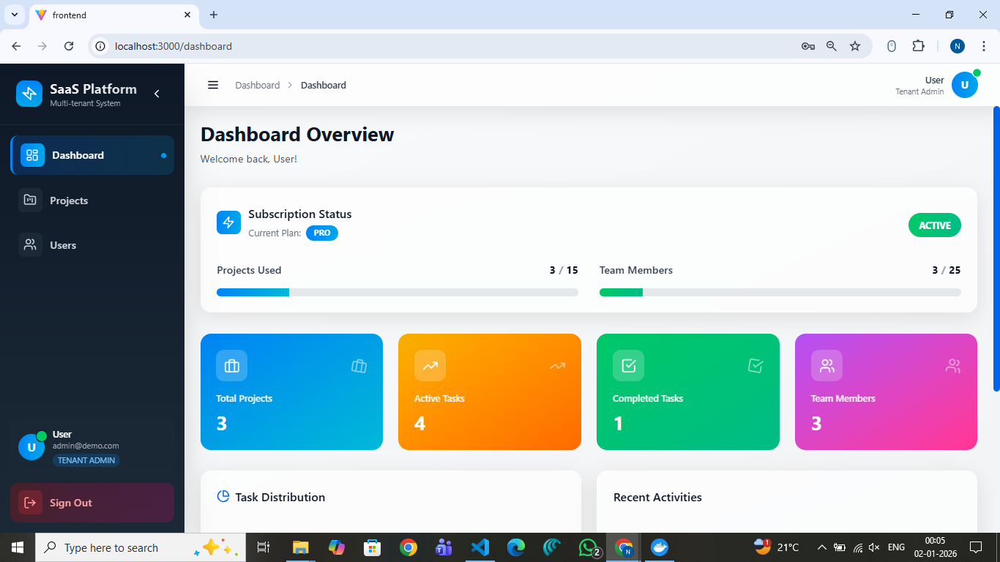
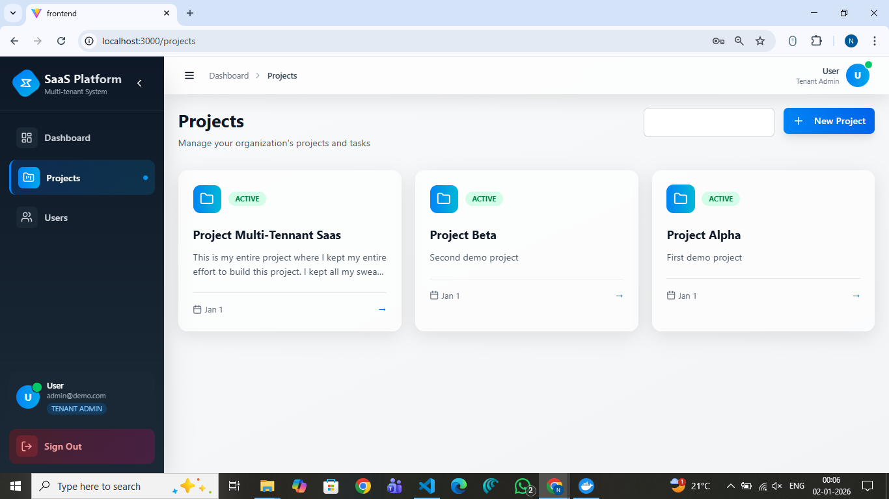
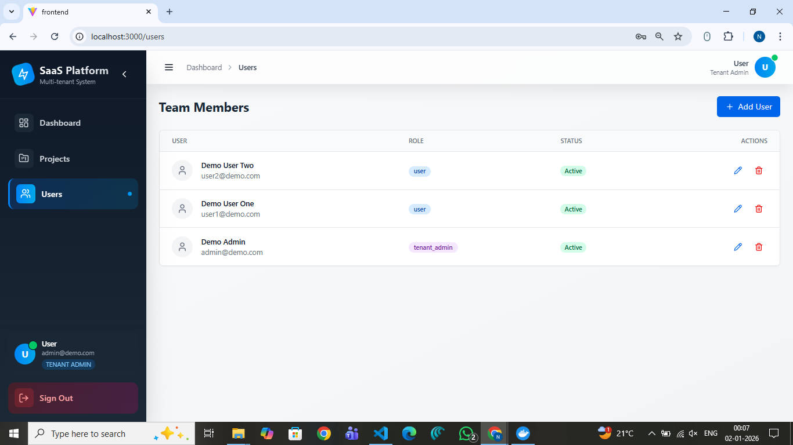

# Multi-Tenant SaaS Platform

This project is a **fully working multi-tenant SaaS application** built using **React, Node.js, PostgreSQL, JWT authentication, and Docker**.  
It allows multiple companies (tenants) to use the same platform while keeping their data completely isolated and secure.

The goal of this project was to build something close to how real SaaS products like Jira, Notion, or Shopify work internally.

---

## What this project does

Each organization that signs up becomes a **tenant**.  
Each tenant has its own:
- Users
- Projects
- Tasks
- Usage limits based on subscription plan

The system makes sure that:
- One company can never see another company’s data
- Users can only access what their role allows
- Each tenant is restricted by its plan (for example, max projects or users)
- The dashboard always shows live data from the database

This is not a mock or demo — it is a real multi-tenant backend and frontend working together.

---

## User roles

The platform has three roles:

| Role | Description |
|------|------------|
| **Super Admin** | Can see and manage all tenants |
| **Tenant Admin** | Can manage users and projects of their company |
| **User** | Can only work inside their organization |

All API requests are checked for both **role** and **tenant** before accessing any data.

---

## Key features

- Multi-tenant data isolation  
- Secure JWT based login system  
- Role-based access control  
- Subscription limits (projects & users)  
- Real-time SaaS dashboard  
- Audit logging for important actions  
- Dockerized backend, frontend, and database  
- Clean and modern SaaS UI  

---

## Project structure

```text
Multi-Tenant-SaaS/
│
├── backend/
│   ├── src/
│   │   ├── controllers/
│   │   ├── routes/
│   │   ├── middleware/
│   │   ├── config/
│   │   └── utils/
│   └── migrations/
│
├── frontend/
│   ├── src/
│   │   ├── pages/
│   │   ├── layouts/
│   │   ├── components/
│   │   └── api/
│
├── docker-compose.yml
└── README.md

# How the system works
  React UI (Nginx)
          ↓
  Node.js API (JWT + Role + Tenant validation)
          ↓
  PostgreSQL (Multi-tenant database)


# Every request:

1. Is authenticated using JWT

2. Is checked for the user’s role

3. Is restricted to the correct tenant

4. Runs only on allowed data

# How to run the project:

  Make sure Docker is installed, then
  docker compose up -d
  Then open:
  http://localhost:3000

# Demo login accounts:

Role	         Email	                    Password
Super Admin	   superadmin@system.com      Admin@123
Tenant Admin	 admin@demo.com             Demo@123
User	         user1@demo.com             User@123

            Tenant subdomain: demo

# Live dashboard

The dashboard shows live data from the database:
  Total projects
  Active tasks
  Completed tasks
  Team members

When a project or user is added, the numbers update automatically.
This proves the system is backend-driven and production-style.

# Screenshots:
  The detail UI can seen through the screenshots folder screenshots.
  ### Login Page
  

  ### Dashboard
  

  ### Projects
  

  ### Users
  

Built by

Naga Sai Satyanarayana Murthy Tejomurthula
B.Tech CSE | Full-Stack Developer Web/Flutter.